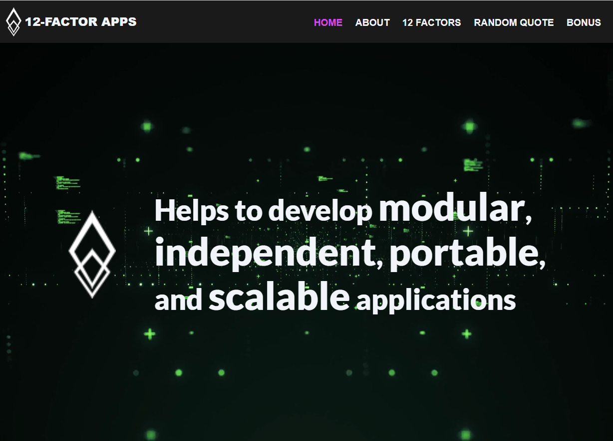
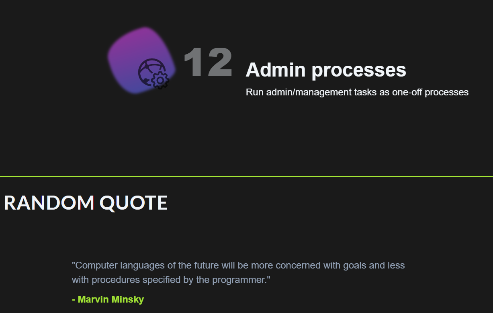

# Basic web-page

This is a simple web-page with a background video and animations dedicated to the twelve-factor methodology.

### Some features of the pages

- Animation of the elements on scrolling

- Parallax animation in the section `Bonus`

- Menu toggler icon (for smaller screens) is a pure CSS icon

- The user can get a random quote about programming (using this (ProgrammingQuotesApi)[ProgrammingQuotesApi])

- Simple subscription form with input validation (it cannot subscribe you). 
It shows a modal window if inputs are correct. First validation goes after first click, revalidation happens after entering valid data


### Start project locally
1. Clone this repository.
2. Install dependencies.

```
npm ci
```

3. Start project. It will be served on [http://localhost:3000](http://localhost:3000/).

```
npm run start
```

### Build project
1. Clone this repository.
2. Install dependencies.
3. Build the project.

```
npm run build
```

### ScreenShots



### Links

[Live site](https://12factors.netlify.app/)

### Built with

- React
- TypeScript
- TailwindCSS
- React Hook Form
- React Scroll

### Author

Maria Serykh
